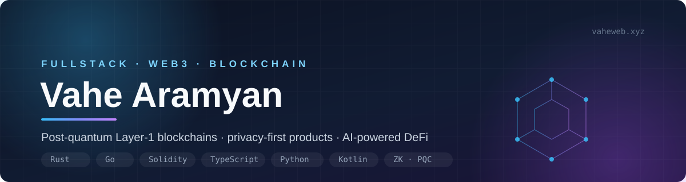

  

  
  
  
  
  

 

I build digital products that live where technology meets ideas — web apps, DApps, DeFi platforms, Telegram Mini Apps, encrypted messengers with video and voice, marketplace analytics and Web3 infrastructure.

Privacy, cryptography and Web3 are what drive me: I build anonymous, decentralized products where control belongs to the user and not to the server. I take on projects with real technical challenges and carry them all the way to production.

<table>
<tr>
<td align="center" width="25%"><b>15+</b> projects shipped</td>
<td align="center" width="25%"><b>6+</b> years of experience</td>
<td align="center" width="25%"><b>13+</b> happy clients</td>
<td align="center" width="25%"><b>2018</b> in crypto since</td>
</tr>
</table>

##  &nbsp;Selected work

<table>
<tr><td>

###  &nbsp;QSN — Quantum Sharded Network

Post-quantum PoS **Layer-1 blockchain written from scratch in Rust**, with the QVM virtual machine and native cross-chain bridges.

    

[Website](https://qsnchain.com/en) &nbsp;·&nbsp; [Explorer](https://qsnscan.io) &nbsp;·&nbsp; [Docs](https://github.com/Vahe327/Quantum-Sharded-Network-Docs)

</td></tr>
<tr><td>

###  &nbsp;Umbera

Anonymous messenger with end-to-end encryption, post-quantum protection and a **zero-knowledge architecture** — keys never leave the device, so not even I can read your messages.

    

[umbera.app](https://umbera.app) &nbsp;·&nbsp; Google Play and App Store — coming soon, links land here once live.

</td></tr>
<tr><td>

###  &nbsp;NixelSysteam

Marketplace analytics SaaS for **Wildberries and Ozon** sellers: unit economics, P&L, repricer, ad bidder and AI recommendations — multi-language and multi-currency.

    

[nixelsysteam.com](https://nixelsysteam.com)

</td></tr>
<tr><td>

###  &nbsp;QsnDEX

AI-powered multichain DEX on Taiko L2 and Arbitrum: **Anti-Rug Shield**, batch swaps and a staking factory.

   

[Website](https://qsndex.xyz) &nbsp;·&nbsp; [Code](https://github.com/Vahe327/QsnDEX)

</td></tr>
<tr><td>

###  &nbsp;TonPulse

AI DeFi trading terminal inside Telegram: swaps, liquidity and yield on TON via STON.fi, guided by an AI assistant.

   

[Code](https://github.com/Vahe327/TonPulse) &nbsp;·&nbsp; [Bot](https://t.me/TonPulseAI1_bot)

</td></tr>
<tr><td>

###  &nbsp;Nixel Chain · NeuroArb

A private Layer-1 (DAG + GHOSTDAG, ring signatures) and an AI arbitrage engine — the research side of the ecosystem.

   

</td></tr>
</table>

**Also on GitHub** — [quantix](https://github.com/Vahe327/quantix), a Solana trading platform (Raydium + Jupiter) &nbsp;·&nbsp; [wildberries_analytics](https://github.com/Vahe327/wildberries_analytics), the first analytics prototype &nbsp;·&nbsp; [PayFlow](https://github.com/Vahe327/Payment-Platform-Test), an async payment platform

##  &nbsp;Tech stack

<table>
<tr><td width="130"><b>Frontend</b></td><td>

    

</td></tr>
<tr><td><b>Backend</b></td><td>

      

</td></tr>
<tr><td><b>Web3</b></td><td>

     

</td></tr>
<tr><td><b>Mobile & infra</b></td><td>

     

</td></tr>
</table>

##  &nbsp;The road here

| Year | What I was building |
|:---|:---|
| **2018** | Bitcoin internals — keys, addresses, entropy |
| **2019** | Python, FastAPI, Flask; applied cryptography research on secp256k1 and low-entropy keys |
| **2020** | REST APIs, parsers and bots, PostgreSQL + Redis, high-load services |
| **2021** | React, TypeScript and Solidity — deep dive into blockchain and DApps |
| **2022** | Smart contracts and DeFi: DEX, AMM, liquidity pools, multichain wallets |
| **2023** | Telegram Mini Apps and TON: FunC, Tact, games with real crypto-economics |
| **2024** | Go, Rust, Next.js, Vue — marketplace analytics, real-time video and voice |
| **2025** | Privacy and blockchain R&D: Rust, ZK, cryptography, Layer-1 protocol work |
| **2026** | Launch of QSN Chain, Nixel Chain and Umbera — a live privacy ecosystem |

##  &nbsp;Let's work together

I'm open to partnerships, investment and grants for **QSN Chain**, and I take on commercial work: Telegram Mini Apps and bots, SaaS platforms, marketplace parsers, AI assistants, smart contracts and DeFi, plus integrations with 1C, CRM and external APIs.

Most of my production work lives in private repositories — happy to walk you through any of it.

 
  
  
Vanadzor, Armenia · working worldwide, remote

